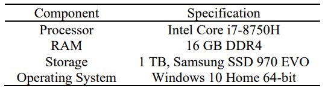
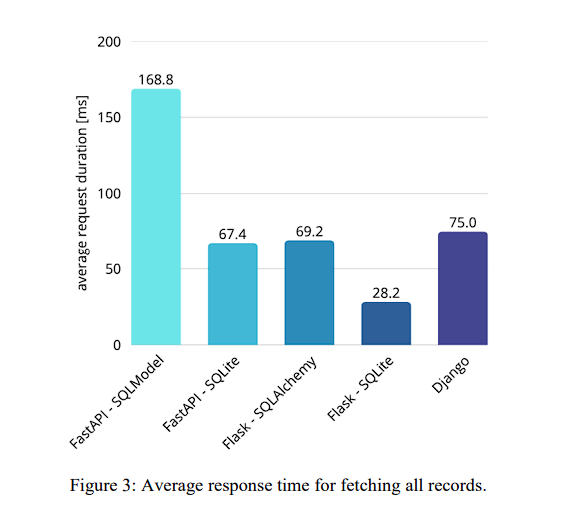

# Entregable 1 - 26 de octubre último commit - 5%

## Métricas de los requerimientos no funcionales

Documentar cada atributo no funcional con valores cuantitativos, parámetros técnicos y tecnologías a usar. Incluir ejemplos claros, abajo se documentan ejemplos de valores y tecnologías, pero ustedes deben diseñar y encontrar sus propios valores los cuales deben estar justificados por alguna teoría o práctica debidamente argumentada y analizada; realizando las extrapolaciones o cálculos que usted pueda diseñar bajo un algoritmo o método cuantitativo diseñado por el grupo mismo. 

Integrantes:
kskskss
ksksks
ksksksk

### Requerimientos No Funcionales (Utilizar estos para desarrollar el Entregable 1)

_Rendimiento_ 

* El tiempo promedio de respuesta del portal web no debe exceder **2.5 segundos** en operaciones estándar.
* Las consultas cacheadas mediante Redis deben entregar resultados en menos de **400 milisegundos**.
* Los procesos de generación automática de contenido o campañas deben ejecutarse en menos de **7 segundos** para solicitudes simples y menos de **20 segundos** para ejecuciones complejas con IA.

_Escalabilidad_

* La arquitectura debe soportar un incremento de **hasta 10 veces** la carga base sin degradación perceptible del rendimiento.
* Kubernetes debe permitir **autoescalado horizontal** basado en CPU, memoria y número de solicitudes concurrentes.
* El sistema debe manejar simultáneamente **más de 5000 campañas activas** y **más de 300 agentes o usuarios concurrentes** distribuidos entre las subempresas.
* Las API de cualquiera de las plataformas podría llegar a alcanzar en el primer año hasta 100000 operaciones de usuario por minuto que requieren acceso a la base de datos, en horario habitual de 7am hasta 7pm. Y hasta 300 procesos no supervisados por minuto ejecutándose en background fuera de horario de oficina. 

_Tolerancia a Fallos_

* Disponibilidad mínima del sistema de **99.9% mensual**.
* Los contenedores críticos deben reiniciarse automáticamente ante fallos o degradación de servicio.
* Redis y las bases de datos deben contar con **replicación en tiempo real** y **failover automático**.
* Implementación de **backups automáticos diarios** y retención mínima de **30 días**.

_Seguridad_

* Autenticación y autorización mediante **OAuth 2.0** para todos los usuarios y servicios.
* Cifrado de todas las comunicaciones entre servicios con **TLS 1.3**.
* Cifrado de datos en reposo con **AES-256** en bases de datos y almacenamiento persistente.
* Auditoría y logging centralizado con retención de **90 días**.
* Cumplimiento con estándares de protección de datos internacionales (**GDPR, CCPA**) y políticas de acceso mínimo necesario (principio de least privilege).

# Hay que diseñar estrategias para cumplir con los requerimientos no funcionales, como evidencia de que la estrategia diseñada cumple los requerimientos no funcionales hay que adjuntar algún benchmark hecho a esa tecnología. Los resultados de estos benchmarks hay que escalarlos a nuestra implementación.

### Performance

El equipo de desarrollo decidió utilizar Python + Django + MySQL en la arquitectura de los dominios.

Para diseñar una arquitectura que cumpla los requerimientos no funcionales establecidos, utilizaremos los benchmarks desarrollados por Bednarz y Miłosz en [Benchmarking the performance of Python web frameworks](/Benchmarking_the_performance_of_Python_web_framewo.pdf).

Los benchmarks se llevaron a cabo en una máquina con las siguientes especificaciones de hardware:

En la página 4 del documento mencionado Bednarz y Miłosz comparan el tiempo promedio que le toma a distintos frameworks de Python realizar una consulta de todos los registros a una base de datos SQLite:

En este test podemos ver que a Django le toma en promedio 75ms devolver todos los registros de una base de datos SQLite. Como se indica en [MySQL vs SQLite](https://highperformancesqlite.com/articles/sqlite-vs-mysql-what-are-the-differences) MySQL es más rápido en escenarios de alta concurrencia con múltiples usuarios. Por lo que podemos asumir que el tiempo promedio que le tomaría a Django devolver todos los registros de una base de datos MySQL no sobrepasa el tiempo que le tomó devolver todos los registros en el benchmark. Uno de los requerimientos no funcionales indica lo siguiente:

* El tiempo promedio de respuesta del portal web no debe exceder **2.5 segundos** en operaciones estándar.

Devolver todos los registros de una base de datos se considera una operación compleja, por lo que se puede asumir que una operación estándar en definitiva le tomará a Django menos de 2.5 segundos.

* Las consultas cacheadas mediante Redis deben entregar resultados en menos de **400 milisegundos**.

Tengo el benchmark pero hacen falta las especificaciones de hardware.

* Los procesos de generación automática de contenido o campañas deben ejecutarse en menos de **7 segundos** para solicitudes simples y menos de **20 segundos** para ejecuciones complejas con IA.

No he encontrado benchmark de conexiones entre MCP server y MCP client.

### Scalability

* Debe soportar incremento de carga de hasta 10x sin degradación.
* Kubernetes configurado con autoescalado horizontal por CPU y memoria. Justificarlo con la configuracion de K8s.

Ya sabemos cuanto hardware ocupamos para cumplir con performance, entonces...

Ejemplo:
Se utilizara kubernetes para contenerización dinámica con un cluster de mínimo X servers con autoscale de tanto. Cada máquina tendrá XXX specs. Aquí está el link al archivo de configuración de kubernetes.

### Reliability

Se va a usar el servicio [Amazon CloudWatch](https://aws.amazon.com/es/cloudwatch/?nc2=type_a) de AWS para el monitoreo de alertas del sistema.
CloudWatch se encargará de recolectar métricas, logs y trazas, además de activar [CloudWatch Alarms](https://docs.aws.amazon.com/AmazonCloudWatch/latest/monitoring/AlarmThatSendsEmail.html) cuando se superen los umbrales definidos.

Las alertas críticas se enviarán mediante [Amazon SNS](https://aws.amazon.com/es/sns/), el cual notificará por SMS, correo electrónico y WhatsApp usando un webhook externo conectado al grupo de soporte técnico de soporte técnico.

Tasa de error permitidos 1% transacciones diarias.

### Availability

* Disponibilidad mínima: 99.9% mensual. En el diseño de infraestructura debe lograr verse como se logra esto, podría ir en el diagrama de arquitectura, pero sería mejor uno de infraestructura. 
* Redis y bases de datos con failover y replicación.
* Considere load balancers. 

Esto se refiere al porcentaje del tiempo que el sistema debería de estar disponible. 98% o 99,7% etc. Existe un ejemplo de esto en el Excel. 

### Security

* Autenticación: OAuth 2.0 y/o OpenID Connect.
* Cifrado TLS 1.3 en comunicación y AES-256 en reposo.

¿Cómo voy a hacer el cifrado y la autenticacion?

Primero decidir si va a ser OAuth o OpenID Connect

REST con SSL 

Para cada base de datos averiguo qué cifrado ofrece y selecciono la opción que más me parezca.
Mongo utiliza XXX cifrado.
SQL Server XXX cifrado...

### Maintainability

* Código modular siguiendo DDD y separación de dominios.
* Documentación en readme.md y comentarios claros en código.

¿Cómo le voy a dar mantenimiento al sistema durante y después?

¿Durante el desarrollo?
Sisteam de tiquetes, investigar sobre GitFlows, PRs, branching, realease process ("van a utilizar branches conversión promptv{}") habrá un release cada 3 semanas, procedimiento de hotfixes.

¿Después de desarrollo?
Buscar niveles de soporte L1, L2 y L3. No queremos tener problemas en L3.
L1: Se le ofrece al usuario manuales y un RAG o bot en WhatsApp que le sirva como asistente a los usuarios.
L2: Se le ofrece la disponibilidad al usuario por email para que el equipo de support le brinda apoyo.
L3: Se ofrece medio y tiempo. Un encargado del equipo técnico se conectará con el usuario para brindarle apoyo.

### Interoperability

En cuanto a la comunicación entre dominios, esta se reserva a que se haga únicamente mediante entes llamados Facades (fachadas).

Se agregó un dominio encargado de proporcionar integración a servicios externos a los demás dominios. Este se llama
`Integration for Extern Services Domain`.

### Compliance

Todo pago o transferencia se hace con servicio de terceros. En nuestro PayPal será nuestro provedor.

A la hora de realizar las pruebas automáticas de Owasp se aceptarán un máximo de dos pruebas críticas, siempre y cuándo ninguna de estas se encuentren en la lista de `OWASP Top 10 - 2021`. Se aceptará toda alerta leve relacionada a algún elemente de UI.

### Extensibility

En futuras versiones el alcance de esta arquitectura se puede extender conectando REST APIs, creando nuevos MCP Servers o incluso acoplando nuevos dominios.

## Domain driven design

### AI and Content Generation Domain
Este dominio se encarga de la creación de contenido textual, audiovisual e imágenes. También opera y ofrece servicios de IA a otros dominios como `Campaign Management and Analitics` y `Crm`.

- Text Generation
- Image Generation
- Video Generation
- AI services provider for other domains

### Campaign Management and Analitics Domain
Este dominio se encarga del diseño, segmentación y publicación de campañas publicitarias en redes sociales, email marketing, SMS, LinkedIn e influencers. También se encarga del análisis en tiempo real del rendimiento de estas campañas. Las campañas son generadas de manera automática a partir de datos de públicos meta y objetivos de venta.

- Campaign Planning: Encargado de diseñar la campaña publicitaria a partir del objetivo definido por el cliente. Define los KPIs, canales, formatos y duración de la campaña.

- Targeting: Selecciona el público objetivo al que se mostrará la campaña, segmentando por datos demográficos, comportamiento, intereses y otras variables.

- Bidding and Budgeting: Establece las reglas de puja y presupuesto. Define cuánto se invertirá por canal o audiencia y cómo se distribuirá la oferta en cada plataforma.

- Activation Manager: Se encarga de activar y publicar la campaña en las plataformas externas (Google Ads, Meta Ads, TikTok, etc.) utilizando listas de control de acceso (ACL) y herramientas de integración.

- Insights: Recopila y presenta métricas clave de desempeño como clics, impresiones, CTR, tasa de conversión y otros indicadores de efectividad en tiempo real.

- Attribution: Asigna crédito de conversión a los distintos canales o interacciones que contribuyeron al cierre de una venta, permitiendo mejorar futuras campañas.

- Experimentation: Permite probar variaciones de campañas, audiencias o mensajes mediante pruebas A/B u otros métodos para optimizar resultados.

- Compliance: Supervisa el cumplimiento de regulaciones locales e internas. Aplica reglas por país o cliente, impone límites de gasto y registra cambios con trazabilidad (quién, qué, cuándo).

### Crm Domain
Este dominio se encarga principalmente del monitoreo de leads. Estos se registran y clasifican automáticamente con sus respectivos datos de proveniencia. Para la interacción con el usuario el dominio ofrece chatbots, voicebots y flujos automatizados de atención. Todo esto es proporcionado por la implementación de IA.

### Business Domain
Este dominio se encarga de validar qué funcionalidades de la plataforma el usuario es capaz de utilizar, esto va a depender del plan al que este se haya suscrito. También se encarga de gestionar todo lo relacionado con pagos por parte del usuario.

### Integration for Extern Services Domain
Este dominio le permite la integración de aplicaciones o servicios externos a los demás dominios.

Plataformas como HubSpot, Salesforce, Zendesk, WhatsApp Business API, Google Ads, Meta Ads, TikTok for Business, Mailchimp, Canva, Adobe, Meta Business Suite y OpenAI API, etc...

Así como servicios de pago como PayPal, o de seguridad como Owasp.

A continuación se muestra un diagrama de los dominios de PromptSales.

