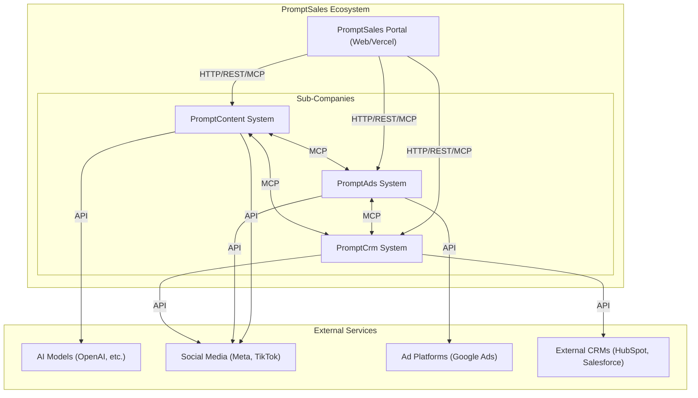
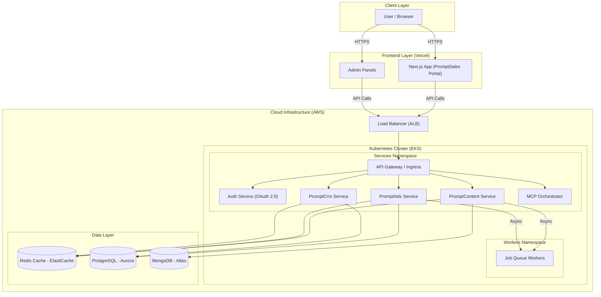
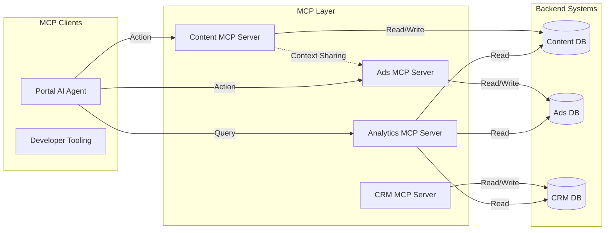

# PromptSales Architecture

## 1. High-Level Architecture

This diagram illustrates the interaction between the central PromptSales Portal and its sub-companies (PromptContent, PromptAds, PromptCrm), along with their integration with external services.

## 2. Infrastructure Architecture

This diagram details the deployment strategy using Kubernetes for backend services and Vercel for frontends, ensuring scalability and high availability.

## 3. MCP (Model Context Protocol) Integration

This diagram focuses on how MCP servers are used to interconnect the sub-companies and provide a unified interface for AI agents and the portal.

