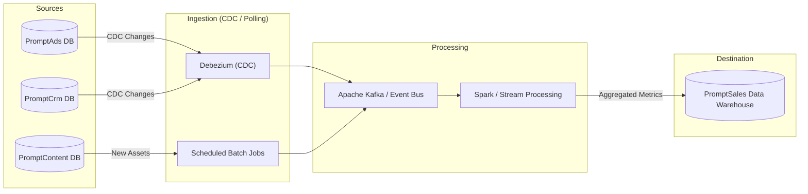

# Database Design & Data Strategy

## 1. Database Engine Selection

| System | Database Engine | Type | Justification |
| :--- | :--- | :--- | :--- |
| **PromptSales (Core)** | **PostgreSQL** | Relational | Requires strict consistency (ACID) for user management, subscriptions, billing, and global reporting. |
| **PromptAds** | **PostgreSQL** | Relational | Campaign structures, budgets, and bidding rules are highly structured and relational. |
| **PromptCrm** | **PostgreSQL** | Relational | Lead tracking and sales pipelines benefit from relational integrity. |
| **PromptContent** | **MongoDB** | NoSQL | Content assets (images, text, video) have variable metadata and schemas. High write throughput for logs/drafts. |
| **Global Cache** | **Redis** | Key-Value | High-speed caching for session data, API responses, and real-time analytics counters. |

## 2. Relational Database Design (PostgreSQL)

### Core Schemas (PromptSales & PromptAds)

```sql
-- Users & Auth
CREATE TABLE users (
    id UUID PRIMARY KEY DEFAULT gen_random_uuid(),
    email VARCHAR(255) UNIQUE NOT NULL,
    password_hash VARCHAR(255) NOT NULL,
    role VARCHAR(50) NOT NULL, -- 'admin', 'marketer', 'viewer'
    created_at TIMESTAMP DEFAULT NOW()
);

-- Subscriptions
CREATE TABLE subscriptions (
    id UUID PRIMARY KEY DEFAULT gen_random_uuid(),
    user_id UUID REFERENCES users(id),
    plan_type VARCHAR(50) NOT NULL, -- 'basic', 'pro', 'enterprise'
    status VARCHAR(20) NOT NULL, -- 'active', 'cancelled'
    start_date TIMESTAMP NOT NULL,
    end_date TIMESTAMP
);

-- Campaigns (PromptAds)
CREATE TABLE campaigns (
    id UUID PRIMARY KEY DEFAULT gen_random_uuid(),
    user_id UUID REFERENCES users(id),
    name VARCHAR(255) NOT NULL,
    objective VARCHAR(100), -- 'brand_awareness', 'conversions'
    budget DECIMAL(10, 2) NOT NULL,
    status VARCHAR(20) DEFAULT 'draft',
    start_date TIMESTAMP,
    end_date TIMESTAMP
);

-- Ad Groups
CREATE TABLE ad_groups (
    id UUID PRIMARY KEY DEFAULT gen_random_uuid(),
    campaign_id UUID REFERENCES campaigns(id),
    name VARCHAR(255) NOT NULL,
    target_audience JSONB -- Flexible targeting rules
);

-- Ads
CREATE TABLE ads (
    id UUID PRIMARY KEY DEFAULT gen_random_uuid(),
    ad_group_id UUID REFERENCES ad_groups(id),
    content_id VARCHAR(255), -- Reference to MongoDB Content ID
    type VARCHAR(50), -- 'image', 'video', 'text'
    status VARCHAR(20)
);

-- Performance Metrics (Time-Series friendly)
CREATE TABLE campaign_metrics (
    id BIGSERIAL PRIMARY KEY,
    campaign_id UUID REFERENCES campaigns(id),
    timestamp TIMESTAMP DEFAULT NOW(),
    impressions INT DEFAULT 0,
    clicks INT DEFAULT 0,
    spend DECIMAL(10, 4) DEFAULT 0.0,
    conversions INT DEFAULT 0
);
```

## 3. Non-Relational Database Design (MongoDB)

### PromptContent Collections

**Collection: `content_assets`**
Stores the actual creative assets generated or uploaded.

```json
{
  "_id": "ObjectId('...')",
  "project_id": "UUID",
  "type": "image", // image, video, text_copy
  "url": "https://s3.amazonaws.com/bucket/asset.jpg",
  "metadata": {
    "width": 1024,
    "height": 1024,
    "format": "jpg",
    "size_bytes": 204800
  },
  "tags": ["summer", "sale", "beach"],
  "ai_generation_info": {
    "model": "dall-e-3",
    "prompt_used": "A sunny beach with a product placement...",
    "generated_at": "2023-10-27T10:00:00Z"
  },
  "status": "approved", // draft, approved, archived
  "created_at": "2023-10-27T10:00:00Z"
}
```

**Collection: `prompt_history`**
Logs all interactions with AI models for auditing and optimization.

```json
{
  "_id": "ObjectId('...')",
  "user_id": "UUID",
  "tool": "chatgpt-4",
  "input_prompt": "Write a catchy slogan for...",
  "output_response": "Sun, Sand, and Savings!",
  "tokens_used": 45,
  "cost": 0.002,
  "timestamp": "2023-10-27T10:05:00Z"
}
```

## 4. Data Pipeline (ETL) Strategy

To centralize analytics in the PromptSales database without querying operational DBs directly.

### Architecture



### Pipeline Rules
1.  **Delta Extraction**: Only fetch records where `updated_at > last_sync_timestamp`.
2.  **Idempotency**: Use `UPSERT` operations in the Data Warehouse to handle duplicate events.
3.  **Anonymization**: PII (Personally Identifiable Information) from CRM is hashed before entering the Data Warehouse.
4.  **Frequency**: 
    *   **Real-time**: Campaign spend and impressions (via Kafka).
    *   **Batch (Hourly)**: Content generation stats and deep CRM analytics.
